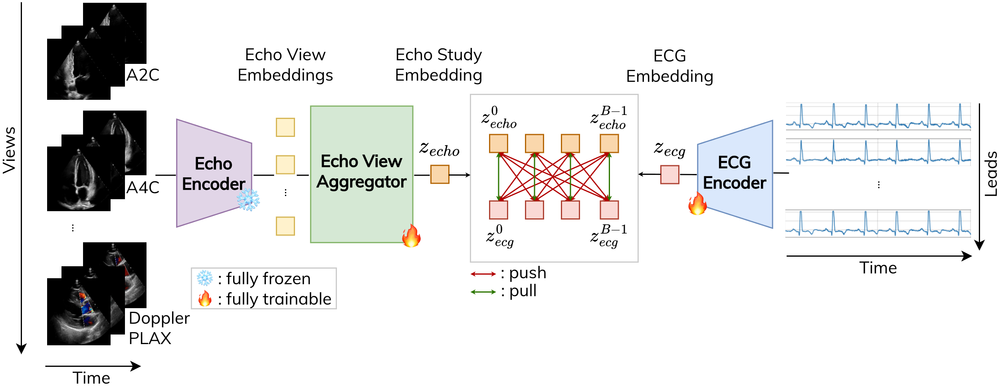

# Echo2ECG: Enhancing ECG Representations with Cardiac Morphology from Multi-View Echos

This is the official PyTorch implementation of Echo2ECG.

[](https://arxiv.org/abs/2603.08505)
[](https://opensource.org/licenses/MIT)

> **Echo2ECG: Enhancing ECG Representations with Cardiac Morphology from Multi-View Echos** <br>
> Michelle Espranita Liman, Özgün Turgut, Alexander Müller, Eimo Martens, Daniel Rueckert, Philip Müller <br>

<p align="center">

</p>

> **Abstract:** Electrocardiography (ECG) is a low-cost, widely used modality for diagnosing electrical abnormalities like atrial fibrillation by capturing the heart's electrical activity. However, it cannot directly measure cardiac morphological phenotypes, such as left ventricular ejection fraction (LVEF), which typically require echocardiography (Echo). Predicting these phenotypes from ECG would enable early, accessible health screening. Existing self-supervised methods suffer from a representational mismatch by aligning ECGs to single-view Echos, which only capture local, spatially restricted anatomical snapshots. To address this, we propose Echo2ECG, a multimodal self-supervised learning framework that enriches ECG representations with the heart's morphological structure captured in multi-view Echos. We evaluate Echo2ECG as an ECG feature extractor on two clinically relevant tasks that fundamentally require morphological information: (1) classification of structural cardiac phenotypes across three datasets, and (2) retrieval of Echo studies with similar morphological characteristics using ECG queries. Our extracted ECG representations consistently outperform those of state-of-the-art unimodal and multimodal baselines across both tasks, despite being 18x smaller than the largest baseline. These results demonstrate that Echo2ECG is a robust, powerful ECG feature extractor.

## 📋 Outline

1. [Getting Started](#getting-started)
2. [Setup](#setup)
3. [Model Usage](#model-usage)
4. [Data Preparation](#data-preparation)
5. [Training and Evaluation](#training-and-evaluation)

<a id="getting-started"></a>
## 🚀 Getting Started

**Use the pre-trained ECG model out-of-the-box in four steps:**

**1. Install**
```bash
conda create -n echo2ecg python=3.12 && conda activate echo2ecg
pip install -r requirements.txt && pip install -e .
```

**2. Download model weights**

Download the pre-trained Echo2ECG weights [here](https://drive.google.com/drive/folders/1CNzxjiKcb_1CwqtMSgvJCjY5kLUlJhi2?usp=sharing) and place them in the `model_weights/` directory.

**3. Preprocess your ECGs**
```bash
python ecg/data_processing/processing.py \
    --input_dir INPUT_DIR \
    --output_dir OUTPUT_DIR \
    --original_freq FREQ
```

**4. Extract ECG embeddings** — see the [Model Usage](#model-usage) section for the full inference snippet.

---

For training your own model, see [Data Preparation](#data-preparation) and [Training and Evaluation](#training-and-evaluation).

<a id="setup"></a>
## 🛠 Setup

```bash
# Create and activate environment
conda create -n echo2ecg python=3.12
conda activate echo2ecg

# Install dependencies
pip install -r requirements.txt

# Install the current package
pip install -e .
```

<a id="model-usage"></a>
## 🫀 Model Usage

```python
import torch

import ecg.models.ECGEncoder as ecg_enc
from ecg.models.token_aggregation.TokenAggregator import TokenAggregator

# load checkpoint
checkpoint = torch.load('./model_weights/echo2ecg.ckpt', map_location='cpu', weights_only=False)
cfg = checkpoint['cfg']

# load ECG encoder
ecg_encoder = ecg_enc.__dict__[cfg.model.ecg.model_name](
    img_size=cfg.model.ecg.input_size,
    patch_size=cfg.model.ecg.patch_size, 
    drop_path_rate=cfg.model.ecg.drop_path_rate,
    use_adapter=cfg.model.ecg.use_adapter,
    adapter_bottleneck_dim=cfg.model.ecg.adapter_bottleneck_dim,
    use_checkpoint=cfg.model.ecg.use_checkpoint
)
ecg_encoder.load_state_dict(checkpoint['ecg_encoder'], strict=False)
ecg_encoder.eval()

# load token aggregator (optional)
token_aggregator = TokenAggregator(cfg, cfg.model.ecg)
token_aggregator.load_state_dict(checkpoint['token_aggregator'], strict=True)
token_aggregator.eval()

# extract ECG embeddings
ecg = torch.randn(1, 1, 12, 1008) # (batch_size, C, V, T)
with torch.no_grad():
    ecg_local_tokens = ecg_encoder.forward_features(ecg) # (B, 1+N, D) where "1+" is the CLS token
    
    # using token aggregator to produce a global token
    ecg_global_token = token_aggregator(ecg_local_tokens)['ecg_global_token'] # (batch_size, embed_dim)

    # not using token aggregator
    ecg_global_token = ecg_local_tokens[:, 1:, :].mean(dim=1) # exclude the CLS token (batch_size, embed_dim)

```

<a id="data-preparation"></a>
## 📊 Data Preparation

### 1) ECG preprocessing

```bash
python ecg/data_processing/processing.py --input_dir INPUT_DIR --output_dir OUTPUT_DIR --original_freq FREQ
```
where:
- `INPUT_DIR`: path to the directory containing ECGs to process
- `OUTPUT_DIR`: path to the directory saving the processed ECGs
- `FREQ`: the original frequency of the ECGs to process (Hz)

⚠️ ECGs before preprocessing may be saved in different formats. Please edit the code if necessary to ensure that they are read properly.

### 2) Echo embeddings for multimodal pre-training

```bash
python echo/data_processing/generate_embeddings.py --echo_encoder_path ECHO_ENCODER_PATH --input_dir INPUT_DIR --output_dir OUTPUT_DIR
```
where:
- `ECHO_ENCODER_PATH`: path to the EchoPrime model
- `INPUT_DIR`: path to the directory containing Echos (`.avi`) to process
- `OUTPUT_DIR`: path to the directory saving the generated Echo embeddings (e.g., `echoprime_echo_embeddings_unnorm.pt`)

### 3) Paired ECG-Echo data for multimodal pre-training

Paired data should be prepared as a `.csv` file. Each row should provide at least:

- `ecg_study_id`
- `echo_study_id`
- `ecg_filepath` (the full path to a `.pt` ECG tensor)
- `echo_filepath` (the full path to an `.avi` Echo) [this is not necessary if only pre-computed Echo embeddings are used for pre-training]
- `echo_embed_idx` (index of the Echo in the pre-computed Echo embeddings)

### 4) Downstream ECG data

Downstream data loaders require two files per split: one ECG file (`data_<train/val/test>`) and one label file (`labels_<train/val/test>`).

For `data_<train/val/test>`, you can provide either:
- a `.pt` file containing preprocessed ECGs in the format `[('ecg', torch.Tensor), ...]` with length `num_samples`, where each tensor has shape `(num_leads, num_timesteps)`, or
- a `.csv` file with a `filename` column pointing to ECG `.pt` files.

`labels_<train/val/test>` must be a `.pt` tensor of shape `(num_samples, num_classes)` with one-hot encoded labels.

<a id="training-and-evaluation"></a>
## 🏋🏻‍♀️ Training and Evaluation

### A) Multimodal pre-training (CLIP)

```bash
# base config: configs/base.yaml
# hyperparameters as used in the paper
python run.py --config-name=base \
    dataset=multimodal/dataset_clip \
    model=multimodal/model_clip \
    train=multimodal/pretrain_clip \
    max_epochs=50 \
    dataset.batch_size=256 \
    dataset.accum_iter=1 \
    dataset.echo.use_precomputed_embeds=true \
    model.echo.view_aggregation.use=true \
    model.echo.view_aggregation.strategy=att \
    model.echo.view_aggregation.num_layers=1 \
    model.echo.view_aggregation.proj_embed_dim=1024 \
    model.alignment.proj_embed_dim=512 \
    train.encoder.ecg.checkpoint_path=<path-to-otis-model> \
    train.encoder.ecg.freeze_first_n_layers=0 \
    train.encoder.echo.freeze_first_n_layers=16 \
    train.params.lr_ecg_encoder=5e-4 \
    train.params.lr=5e-4 \
    train.params.weight_decay_ecg_encoder=1e-7 \
    train.params.weight_decay=1e-7 \
    train.params.layer_decay=0.75 \
    train.params.scheduler.warmup_cosine.warmup_steps=2 \
    train.clip_loss.temperature=0.5
```
Important configs:
- Update `home_dir` in `configs/base.yaml` (recommended: path to this repo)
- Adjust filepaths to the data in `configs/dataset_clip.yaml`
- Using ECG <-> Multi-view Echo alignment: `model.echo.view_aggregation.use=true`
- Using ECG <-> Single-view Echo alignment: `model.echo.view_aggregation.use=false`
- Using pre-computed echo embeddings: `dataset.echo.use_precomputed_embeds=true`
- Initializing ECG encoder with OTiS weights: `train.encoder.ecg.checkpoint_path=<path-to-otis-model>`
- Fully freezing Echo encoder layers: `train.encoder.echo.freeze_first_n_layers=16`

Outputs under `checkpoints/`, including:
- `ecg_multimodal.ckpt`
- `echo_multimodal.ckpt`
- `token_aggregator.ckpt`
- `ecg_alignment_global_token.ckpt`
- `echo_alignment_global_token.ckpt`
- optionally `echo_projection_for_agg.ckpt`, `echo_view_aggregator.ckpt`


### B) Downstream ECG: kNN evaluation

```bash
# base config: configs/base_ecg_linearprobe.yaml
python run.py --config-name=base_ecg_linearprobe \
    downstream_task_ecg=<downstream-task> \
    downstream_task_ecg.time_steps=1008 \
    downstream_task_ecg.apply_augmentations=false \
    ecg_encoder_checkpoint_path=<path-to-ecg-model> \
    token_aggregator_path=<path-to-token-aggregator> \
    ecg_alignment_path=null
```
Important configs:
- Update `home_dir` in `configs/base_ecg_linearprobe.yaml` (recommended: path to this repo)
- Adjust filepaths to the data in `configs/downstream_task_ecg/<downstream-task>.yaml`
- After multimodal pre-training, `ecg_encoder_checkpoint_path` should be the path to `ecg_multimodal.ckpt` and `token_aggregator_path` should be the path to `token_aggregator.ckpt`
- Run evaluation on val set: `validate=true`
- Run evaluation on test set: `test=true`

To add a new downstream ECG task, add a new config file `<downstream-task>.yaml `in the `configs/downstream_task_ecg` folder and pass it via `downstream_task_ecg=<downstream-task>`.

### C) ECG->Echo Retrieval

Coming soon

## 📄 Citation

If you find this work useful, please cite:

```bibtex
@misc{liman2026echo2ecgenhancingecgrepresentations,
      title={Echo2ECG: Enhancing ECG Representations with Cardiac Morphology from Multi-View Echos}, 
      author={Michelle Espranita Liman and Özgün Turgut and Alexander Müller and Eimo Martens and Daniel Rueckert and Philip Müller},
      year={2026},
      eprint={2603.08505},
      archivePrefix={arXiv},
      primaryClass={cs.LG},
      url={https://arxiv.org/abs/2603.08505}, 
}
```

## License

This project is licensed under the MIT License — see the [LICENSE](LICENSE) file for details.